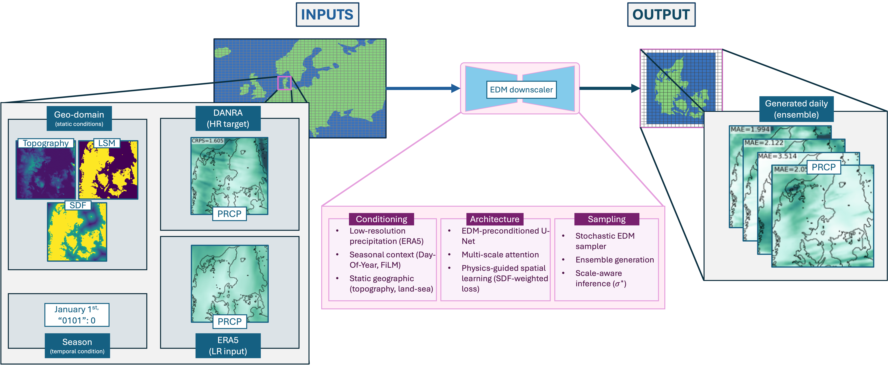
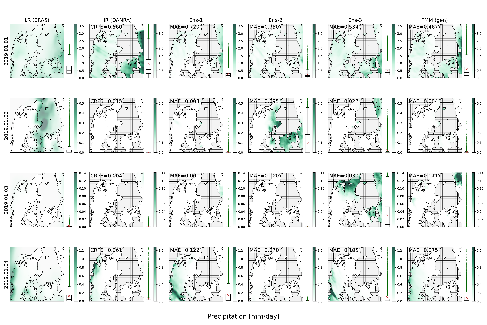

# CEDDAR

## Controllable Ensemble Diffusion Downscaling for Atmospheric Rainfall

CEDDAR is a diffusion-based statistical downscaling framework for generating high-resolution precipitation ensembles over Denmark from low-resolution ERA5 precipitation.

It is built around the Elucidated Diffusion Model (EDM) and includes a modular evaluation suite tailored to precipitation (probabilistic, spatial, distributional, and temporal diagnostics).

---

## Overview


CEDDAR learns a conditional generative mapping:

ERA5 (low resolution) → DANRA-scale (high resolution)

Key ideas:
- Diffusion-based generative modelling of precipitation fields
- Ensemble generation for uncertainty quantification
- Scale control through sampling parameters (e.g., $\sigma^{*}$)
- Evaluation suite focused on precipitation skill (CRPS, MAE, spatial structure)

---

## Example outputs


CEDDAR produces:
- Spatially structured high-resolution precipitation fields
- Ensemble variability across members
- Probabilistic evaluation maps (e.g., mean CRPS)
- Date-based diagnostics with CRPS and MAE

The reduced reproducibility run (repro/04_reduced_run) generates figures similar to the examples above.

---

## Quickstart (Reproducibility)

Follow the [portable setup guide](repro/README.md) for the external environment,
CPU wheels, tcsh/bash syntax and run paths. Then start with:

```bash
bash repro/01_small_test/run_small_test.sh
```

Level 01 creates synthetic inputs and random weights; no dataset download is needed.
[Level 02](repro/02_real_artifact_smoke/README.md) checks a supplied checkpoint against
real inputs and matching training statistics. Level 03 is reserved/unimplemented.
[Level 04](repro/04_reduced_run/README.md) deliberately trains on real data; its LUMI
launcher remains a site-specific template. None of these reproduces manuscript skill
by passing a smoke check.

---

## Usage

CEDDAR is configuration-driven, with modular runners for local and HPC execution, with example usage:
```bash
bash repro/run_model.sh --config_path path/to/config.yaml --mode train --device cpu
```
For working examples, use the reproducibility workflows in repro/ or the full ablation and model bash scripts in bash_scripts/ or bash_ablations/.

---

## Data

Full datasets are not included due to size and licensing.
A small example dataset (Data_DiffMod_small) is available on Zenodo for testing and reproducibility purposes.
The full dataset used in the paper can be reproduced by following the data processing steps outlined in the paper and code, starting from ERA5 precipitation data or by contacting the authors for access to the processed dataset.

---

## Citation
```bibtex
@misc{CEDDAR,
    author          = {Quistgaard, Thea and collaborators},
    title           = {CEDDAR: Controllable Ensemble Diffusion Downscaling for Atmospheric Rainfall},
    year            = {2026},
    howpublished    = {GitHub repository}, 
}
```

---

## License

MIT License. See LICENSE file for details.